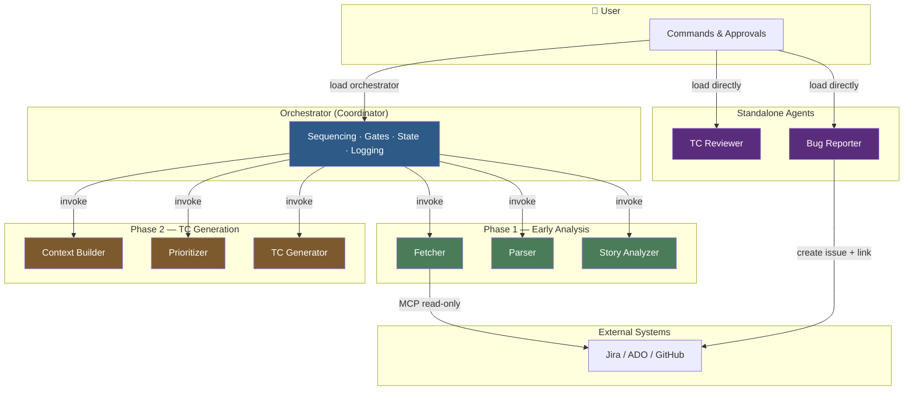
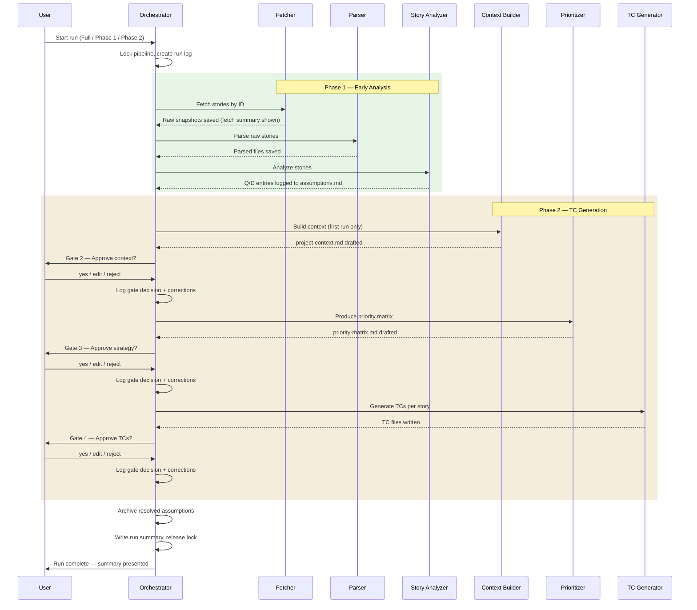
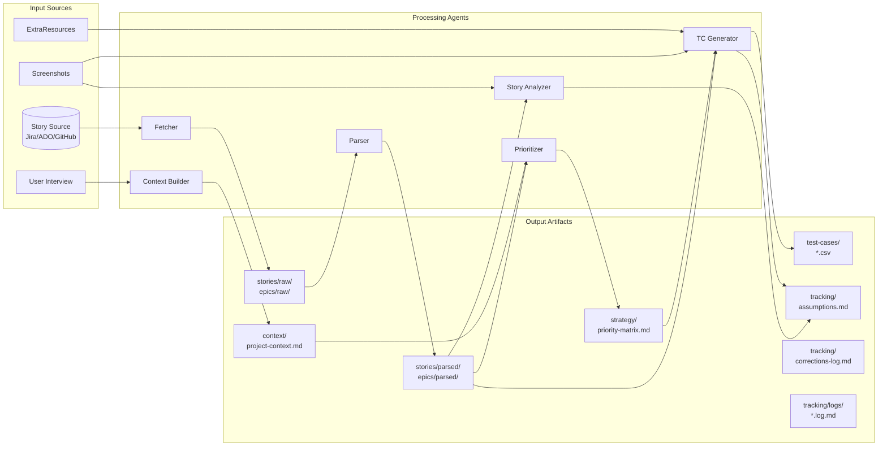
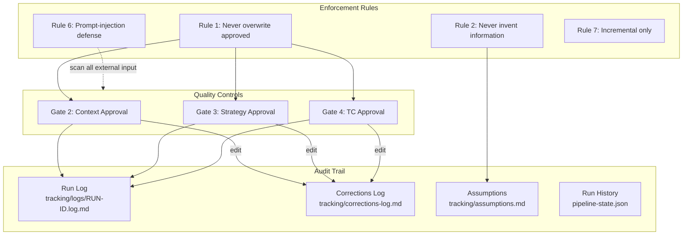

# Architecture — QA Pipeline Multi-Agent System

This document provides a visual overview of the pipeline's agent orchestration, data flow, and governance model.

---

## System Overview

---

## Pipeline Sequence & Approval Gates

---

## Data Flow & File Ownership

---

## Governance Model

---

## Permission Matrix

Each agent has strictly scoped read/write permissions. No agent operates outside its boundary.

| Agent | Reads | Writes | External Access |
|-------|-------|--------|-----------------|
| **Orchestrator** | pipeline-state, registries | pipeline-state, projects.json, run logs, corrections log | None |
| **Fetcher** | story source (MCP), registries, source-config | stories/raw, epics/raw, registries | Story source (read-only) |
| **Parser** | stories/raw, epics/raw | stories/parsed, epics/parsed | None |
| **Story Analyzer** | stories/parsed, epics/parsed, screenshots | tracking/assumptions.md | None |
| **Context Builder** | epics/parsed, stories/parsed, user input | context/project-context.md | None |
| **Prioritizer** | stories/parsed, epics/parsed, context | strategy/priority-matrix.md, tracking/assumptions.md | None |
| **TC Generator** | stories/parsed, context, strategy, screenshots, ExtraResources | test-cases/*.csv, tracking/assumptions.md | None |
| **TC Reviewer** | test-cases/*.csv, priority-matrix.md | tracking/reviews/ (optional) | None |
| **Bug Reporter** | TC files, registries, user input | bugs/drafts/ | Jira (create issue + link only) |

---

## Skills (Cross-Agent Utilities)

| Skill | Used By | Purpose |
|-------|---------|---------|
| **assumption-tracker** | Story Analyzer, Prioritizer, TC Generator, Context Builder | Log/resolve A-NNN, Q-NNN, B-NNN, D-NNN entries |
| **prereq-checker** | All agents (via Orchestrator) | Verify required files and states before execution |
