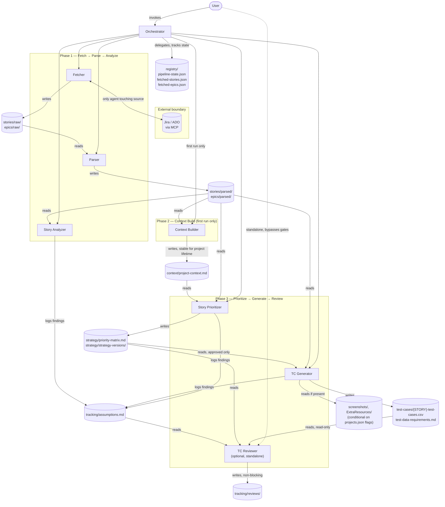

# Architecture — PipelineQA

PipelineQA has no application code, server process, or deployed runtime. It is a set of
Markdown agent definitions (`.claude/agents/*.md` for Claude Code, `.github/agents/*.agent.md`
for GitHub Copilot) executed interactively inside the host tool, coordinated by the
Orchestrator agent and governed by a shared rules file
(`.claude/instructions/global-rules.md`). State and hand-offs between agents are files on
disk, not in-memory objects or API calls — every arrow in the diagram below is a file read
or write, per the authoritative layout in
[`.claude/instructions/path-schema.md`](../.claude/instructions/path-schema.md).

## Pipeline flow

## Notes

- **Gates.** Every phase transition in the Orchestrator's delegated flow requires explicit
  user approval (`global-rules.md` Rule 9) before the next agent runs — the diagram shows
  data flow, not an autonomous loop.
- **Single external boundary.** Only the Fetcher talks to Jira/ADO (via the
  `mcp__claude_ai_Atlassian_Rovo__getJiraIssue` MCP tool). Every other agent reads locked
  snapshots the Fetcher already wrote — no other agent can reach the story source.
- **Conditional paths.** `epics/`, `screenshots/`, and `ExtraResources/` only exist when the
  corresponding flag (`has_epics`, `has_screenshots`, `has_extra_resources`) is set per
  project in `projects.json`; see `path-schema.md` for the full conditional rules (P-3 to P-5).
- **TC Reviewer is out-of-band.** It runs standalone on user request, reads already-approved
  artifacts, and only ever writes recommendation reports — it never blocks the pipeline and
  is not sequenced by the Orchestrator.
- **Two platform trees, one contract.** `.github/agents/*.agent.md` (Copilot) mirrors
  `.claude/agents/*.md` (Claude Code) with identical roles, inputs, and outputs; the one
  documented deviation is the Fetcher invocation path (inline vs. subagent) noted in
  `orchestrator.md`, which is a platform capability difference, not a business-logic change.
